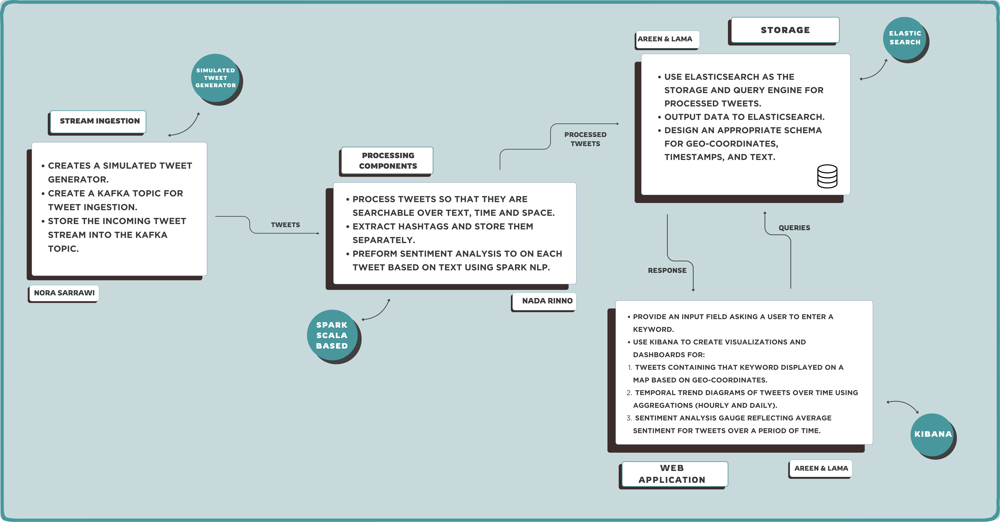

# Twitter-Stream-Processing
## Project overview
Twitter Stream Processing Pipeline that is designed to stream, process, store, and visualize tweets. The pipeline handles the streaming of tweets, processes them for analysis, and stores the results in Elasticsearch. It also uses Kibana as a visualization tool that to create an interactive dashboard which enables users to search tweets by keywords, view them on a map, analyze trends over time, and assess sentiment distribution.

### Project Structure
- **Stream Ingestion**: Uses Apache Kafka to manage a continuous stream of tweets from a simulated tweet generator.
- **Data Processing**: Processes tweets, extracts hashtags, processes geo-coordinates, and analyzes tweet sentiment.
- **Data Storage**: Stores processed tweets in Elasticsearch with an appropriate mapping for spatial, temporal, and text-based queries.
- **Visualization**: Displays visualizations with maps, trend diagrams, and sentiment gauges.

---


---

## Installation and Setup Guide
### Prerequisites
- **Requirements**:
  - Java 8+
  - Spark 3.5
  - Scala 2.12
  - Apache Kafka 3.5.1
  - Elasticsearch 8.16.1
  - Kibana 8.16.1

### Installation
- Step 1: Install Kafka
  - Download Kafka:
    - Visit the [Kafka](https://kafka.apache.org) downloads page.
    - Install the Kafka 3.5.1 version for Scala 2.12.
    - Extract the downloaded file to a directory (`e.g., C:/kafka`).  
    - Ensure Java is installed and set up in your environment variables (JAVA_HOME).

- Step 2: Install Elasticsearch
  - Download Elasticsearch:
    - Visit the [Elasticsearch](https://www.elastic.co/downloads/elasticsearch) downloads page.
    - Install the 8.16.1 Elasticsearch version.
    - Extract the downloaded file to a directory (`e.g., C:/elasticsearch`).

- Step 3: Install Kibana
  - Download Elasticsearch:
    - Visit the [Kibana](https://www.elastic.co/downloads/kibana) downloads page.
    - Install the 8.16.1 Kibana version.
    - Extract the downloaded file to a directory (`e.g., C:/kibana`).

---

### How to run the project:
1. **Set Up Kafka**:
- Download and install Kafka. Write the following commands in the root Kafka folder:
   - Start Zookeeper:
     - For Windows: 
         ```bash
         .\bin\windows\zookeeper-server-start.bat .\config\zookeeper.properties
         ```
      - For MacOS: 
         ```bash
         ./bin/zookeeper-server-start.sh ./config/zookeeper.properties
         ```
   - Start the Kafka server:
      - For Windows: 
         ```bash
         .\bin\windows\kafka-server-start.bat .\config\server.properties
         ```
      - For MacOS: 
         ```bash
         ./bin/kafka-server-start.sh ./config/server.properties
         ```
   - Create the Kafka topic:
      - For Windows: 
         ```bash
         .\bin\windows\kafka-topics.bat --create --topic tweets --bootstrap-server localhost:9092
         ```
      - For MacOS: 
         ```bash
         ./bin/kafka-topics.sh --create --topic tweets --bootstrap-server localhost:9092
         ```
         
     
2. **Set Up Elasticsearch**:
   - Download and install Elasticsearch. Write the following command inside the bin folder:
   - Start Elasticsearch:
     - For Windows: 
         ```bash
         elasticsearch.bat
         ```
      - For MacOS: 
         ```bash
         ./elasticsearch
         ```
   - Wait for it to load, then open `localhost:9200`. make sure you see the expected JSON output
   - Create the index and apply the mapping in Kibana DevTools, Postman or the like.
   -  Mapping is found inside `index-mapping.json` in the `Elasticsearch` directory.

3. **Create .env file**:
   - Create a new `.env` file inside `spark-streaming` directory. Add to it variables as shown in `.env.example` and give them values for your elasticsearch username, password and path to the http_ca.crt certificate file - like: "C:\elasticsearch-8.16.1\config\certs\http_ca.crt".

4. **Set up Kibana**:
   - Start Kibana. Write the following command inside the bin folder:
     - For Windows: 
         ```bash
         kibana.bat
         ```
      - For MacOS: 
         ```bash
         ./kibana
         ```
   - Wait for it to load, then open `localhost:5601`. It may take some time.
   - When open, enter your Elasticsearch username and password.

5. **Run the Producer and Consumer**:
   - Navigate to the `spark-streaming` directory and run both `Producer` and `Consumer` simultaneously using a compound run configuration. Here:
   - The producer reads tweets from `data/boulder_flood_geolocated_tweets.json` and sends them to the Kafka topic.
   - The consumer reads tweets from Kafka, processes them, and stores the results in Elasticsearch.
  
       - Note: Make sure you add your Elasticsearch certificate is added to the JVM Trustore, otherwise the code will not be able to detect Elasticsearch. You can do so by running the following command: (The default <truststore_password> is `changeit`)
       ```bash
       keytool -importcert -alias elasticsearch-cert -file "<path_to_certificate_file>" -keystore "<path_to_jvm_truststore>" -storepass <truststore_password>
       ```

5. **Import Dashboard in Kibana**:
  - Once Kibana is started, follow these steps to import the provided dashboard:

    - In the Kibana interface, click on the "Management" menu in the left sidebar.
    - Under the "Stack Management" section, select "Saved Objects".
    - Click on the "Import" button.
    - Choose the provided dashboard JSON file (e.g., dashboard.json) from your local system.
    - If prompted to overwrite existing objects, select the appropriate option based on your preference.

    - Verify the Import:
    - After the import is successful, navigate to the "Dashboards" section in Kibana to view the imported dashboard.
    - Update Index Patterns (if needed):
        - Go to "Stack Management" > "Index Patterns", and ensure the required index pattern is configured.

---

### Details of Each Component:
1. **Producer**:
   - Creates a simulated tweet generator. 
   - Creates a Kafka topic for tweet ingestion. 
   - Stores the incoming tweet stream into the Kafka topic.

2. **Consumer**:
   - Reads incoming tweets from Kafka topic.
   - Process tweets so that they are searchable over text, time and space.
   - Extract hashtags and store them separately.
   - Preform Sentiment Analysis to on each tweet based on text using Spark NLP.
   - Writes the processed data to Elasticsearch.

3. **Elasticsearch**:
   - Use Elasticsearch as the storage engine for processed tweets. 
   - Design an appropriate mapping for geo-coordinates, timestamps, and text. 

4. **Kibana Dashboard**:
   - Visualizes tweets on a map, trends over time, and sentiment distribution.
   - Provide an input field asking a user to enter a keyword.
   - Use Kibana to create visualizations and dashboards for:
       -  Tweets containing that keyword displayed on a map based on geo-coordinates. 
       -  Temporal trend diagrams of tweets over time using aggregations (hourly and daily). 
       -  Sentiment analysis gauge reflecting average sentiment for tweets over a period of time. 

---
